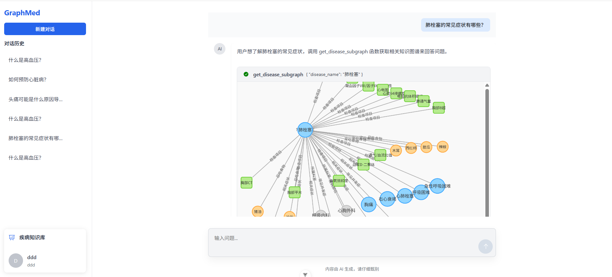
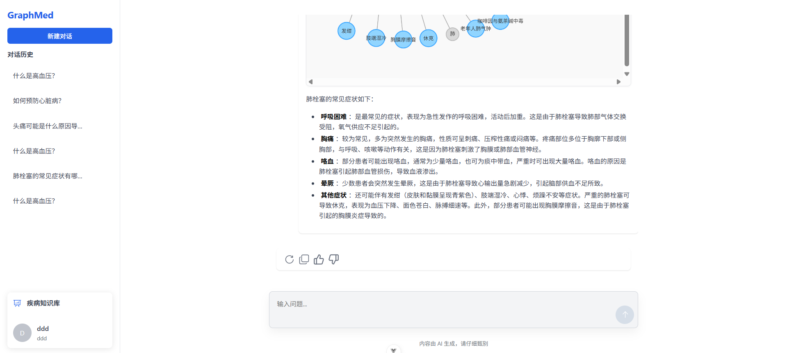

# Graph-Med 医疗知识图谱应用

## 项目介绍

Graph-Med 是一个基于知识图谱的医疗信息查询和智能问答系统，旨在提供专业、准确的医疗知识服务。系统整合了疾病、症状、治疗方法等医疗知识，通过图数据库构建知识网络，并结合大语言模型提供智能化的医疗咨询服务。

## 后端技术栈

- **编程语言**：Go 1.23
- **Web框架**：Gin
- **数据库**：
  - MySQL：存储用户数据、聊天记录等关系型数据
  - Neo4j：存储医疗知识图谱数据
- **缓存**：Redis
- **权限管理**：Casbin
- **依赖注入**：Wire
- **MCP服务**：mcp-go
- **认证授权**：JWT

## 大语言模型集成

- 火山引擎 ARK Runtime API 集成
- MCP (Model Control Protocol) 工具集成，用于模型控制和功能扩展

## 运行截图




## 核心功能

### 1. 用户认证与授权

- 用户注册、登录功能
- 基于JWT的身份验证
- 基于Casbin的RBAC权限控制
- 验证码与邮箱验证

### 2. 医疗知识图谱

- 疾病信息查询
- 多标签分类浏览
- 知识图谱可视化
- 节点关系查询

### 3. 智能问答系统

- 基于大语言模型的医疗问答
- 会话管理与历史记录
- 用户反馈收集
- 实时流式响应
- 知识图谱增强的医疗问答

### 4. MCP服务功能

- 知识图谱工具调用
- 医疗专业提示词管理
- 疾病子图查询
- 大语言模型能力增强

## 项目结构

```
├── cmd                 # 命令行入口
│   ├── app            # API服务入口
│   └── mcp            # MCP服务入口
├── configs            # 配置文件
├── db                 # 数据库脚本
├── internal           # 内部包
│   ├── base           # 基础组件
│   ├── controller     # 控制器
│   ├── middleware     # 中间件
│   ├── model          # 数据模型
│   ├── repository     # 数据访问层
│   ├── router         # 路由
│   ├── schema         # 数据结构
│   ├── server         # 服务器
│   ├── service        # 业务逻辑层
│   └── utils          # 工具函数
├── script             # 脚本文件
└── sbin               # 编译后的二进制文件
```
